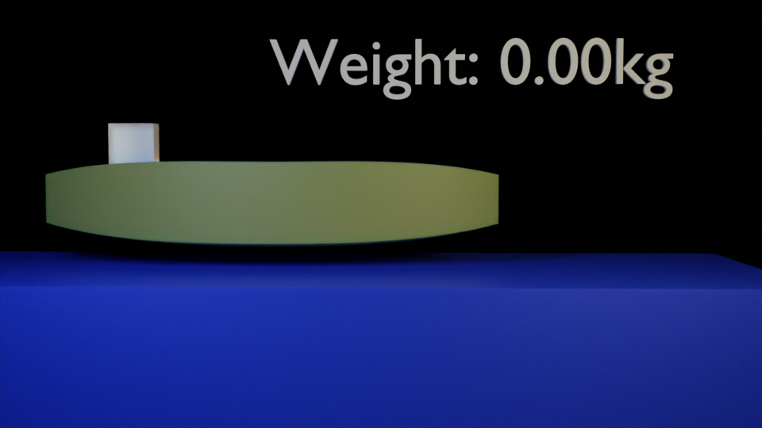
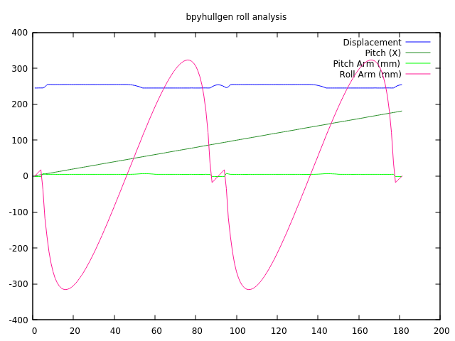

# bpyhullsim

blender based buoyancy simulator written in python

Designed for use with: [bpyhullgen](https://edzop.github.io/bpyhullgen/)

For further information please refer to [bpyhullgen Github Wiki](https://github.com/edzop/bpyhullgen/wiki)


## Measure
### SelectedFaces
Measures the selected faces of the current object. The number of selected faces and total surface area of selected faces for current object will be displayed in the status bar.
### AllFaces
Measures all the faces of the current object. The total number of faces and total surface area of all faces will be displayed in the status bar. 
### MeasureVolume
The volume for the currently selected object will be displayed in the status bar. Only the first object is calculated if multiple selections exist. 
### Calc CG
Calculates the center of mass for multiple objects. A new empty named "CG" will be created in the scene and placed where the center of gravity exists. Multiple object selections are allowed. 

## Hydrostatics

A basic simulation loop can be used to calculate waterline and other hydrostatic parameters for a defined hull. 

### Submerge
The submerge simulation is used to calculate the waterline and balance in water for a specific weight. The weight is defined by the HullWeight GUI textbox and expressed in KG.

A text object with the displacement weight is generated automatically and updated when frames change. The weight data is cached after the simulation so when you render an animation you can see the displacement value for each step of the simulation. 

The displacement data cache is stored in memory and is not saved with the blender file - If you close and reload the blender file and notice you don't see the text updating between frames you may need to rerun the simulation.

The text changing between frames uses a frame_change_handler callback function. 



### RollTest
The rollover test simulation is used to calcualte the righting moment for the hull when tipped over to a specific angle. The rollover test will roll the hull from 0-180 degrees and record the displacement and righting moment (roll arm about X axis) for each angle. 

The roll test uses one degree increments and for each increment several simulation substeps may occur until the hull is submerged to an equilibrium (stabilized state).

The simulation data will be written to hydro.csv file. And a gnuplot file is provided to easily map this data with the command:

```
gnuplot -p plot_rollover.gnuplot
```


* Amination needed

Select any mesh object and click the RollTest button. 

Animation keyframes are created for each degree of rotation so you can see how the displacement shifts for each angle. 

### HullWeight

not documented yet