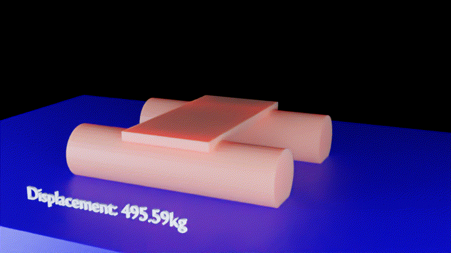

# bpyhullsim

Hull buoyancy simulator written in python to be used as a [blender](https://www.blender.org/) extension. 

It accepts a watertight mesh hull object as the input and will submerge the object into a simulated body of water to determine water level based on a specific weight and also balance the roll and pitch of the hull until stabilized as an equilibrium to see how the object will rest in the water.

Center of gravity and weight can be adjusted for different loading scenarios. 

You can perform hull stability analysis using RollTest feature which can simulate a hull rollover to determine righting moment for a range of roll angles. 

Designed for use with: [bpyhullgen](https://edzop.github.io/bpyhullgen/)

Requires blender 2.92 or later. 

For further information please refer to [bpyhullgen Github Wiki](https://github.com/edzop/bpyhullgen/wiki)


## User Interface
bpyhullgen has a sidebar panel tab user interface. It may not be visible if an object is not selected. 


## Measure
### SelectedFaces
Measures the selected faces of the current object. The number of selected faces and total surface area of selected faces for current object will be displayed in the status bar.
### AllFaces
Measures all the faces of the current object. The total number of faces and total surface area of all faces will be displayed in the status bar. 
### MeasureVolume
The volume for the currently selected object will be displayed in the status bar. Only the first object is calculated if multiple selections exist. 
### Calc CG
Calculates the center of mass for multiple objects. A new empty named "CG" will be created in the scene and placed where the center of gravity is calculated according to the center of mass. Multiple object selections are allowed. If multiple objects are selected the CG will be placed according to the center of multiple objects. The moment (weight x arm) will be calculated for each object on each axis (X,Y,Z) then the total moment for each axis will be divided by the total weight to come up with the average CG of the group of objects.

## Hydrostatics

A basic simulation loop can be used to calculate waterline and other hydrostatic parameters for a defined hull. 

An sphere shaped empty object named ```CG``` is created and the selected object is parented to the ```CG``` empty so any transformations and keyframes do not affect the original object. The simulation is non destructive - To delete the simulation data and reset objects to original position, just delete the ```CG``` empty object. By default the center of gravity is calculated according to the center of mass, but can be adjusted by moving the desired object in relation to the ```CG``` object before running the simulation - it will behave differently because the center of gravity is offset. 

A queue (history) of displacement differentials is stored internally to detect velocity. 

A text object named ```buoyancy_text``` to display the displacement weight is generated automatically and updated when frames change. The weight data is cached after the simulation so when you render an animation you can see the displacement value for each step of the simulation.

The arm is the length in units between the center of gravity point associated with the simulation target object and the center of mass of the displaced water object. The arm's are calculated for Pitch (Y Axis) and Roll (X Axis). Whenever there is an offset between these points the simulation tries to rotate the simulation target object or adjust the height (Z position) of the simulation target object then continue to the next step of the simulation until all these forces are equalized and an equilibrium is reached. 

The simulation is continued until the Pitch Arm Difference (Y Axis), Roll Arm Difference (X Axis) and Displacement Difference (Displacement Weight in relation to HullWeight) all reach equilibrium. 

If you are running a rollover simulation the Roll is locked and the pitch and height are allowed to be adjusted to try to reach an equilibrium. 

In the event there is a problem or it can't be solved for some reason it will abort after reaching the number of simulation steps specified in the limit steps UI field. 

It's highly recommend to launch the simulation from the command line console so you can see the debug output and see what's going on. 

I experimented with the command `bpy.ops.wm.redraw_timer(type='DRAW_WIN_SWAP', iterations=1)` in the file `sim_helper.py` - it's commented out for now. The simulation runs faster without updates but you can disable it to get UI updates to watch the simulation in real time but warnings are displayed by blender sometimes complaining the UI is behind. I also tried `bpy.context.view_layer.update()` to get the gui to update while simulation is running but that didn't seem to do anything. 

I've spent quite a bit of time trying to figure out how to abort the simulation with ESC key or something like that and posted several questions on forums [here](https://blenderartists.org/t/abort-ui-python-simulation/1257067) and [here](https://blender.stackexchange.com/questions/197134/simulation-in-blender-python-respond-to-keypress-without-timer) but have not been able to solve this. 


I'm trying to use `bmesh` as much as possible instead of `bpy.ops` and it's quite fast. 

 The best way to abort the simulation that's in progress is to press ```Ctrl-C``` from the command line while the simulation is running. Usually the simulation will abort and blender will remain open so you can adjust some things in the scene and rerun the simulation. Sometimes ```Ctrl-C``` does not respond I think this is the way the blender python script architecture is and I haven't found a workaround for this yet. 


### Submerge
The submerge simulation is used to calculate the waterline and balance in water for a specific weight. 


The simulation data is stored in the file ```bpyhullsim_hydro_submerge.csv```

```
gnuplot -p plot_displacement.gnuplot
```

The text changing between frames uses a frame_change_handler callback function. 

Simple cube derived mesh submerged to 2000kg and finding it's equilibrium based on center of buoyancy


More complex mesh 500kg more rotation is needed to reach equilibrium due to asymmetrical shape


Asymmetrical catamaran shaped hull - note the rotation due to uneven floatation on each side.


Submerge to 4000kg displacement


Submerge with weight on front of vessel (affects center of gravity)


### RollTest
The rollover test simulation is used to calculate the righting moment for the hull when tipped over to a specific angle. The rollover test will roll the hull from 0-180 degrees and record the displacement and righting moment (roll arm about X axis) for each angle. 

The roll test uses one degree increments and for each increment several simulation substeps may occur until the hull is submerged to an equilibrium (stabilized state).

The simulation data is stored in the file ```bpyhullsim_hydro_rollover.csv```

The simulation data will be written to hydro.csv file. And a gnuplot file is provided in the installation directory to easily map this data with the command:

```
gnuplot -p plot_rollover.gnuplot
```

Select any mesh object and click the RollTest button. 

Animation keyframes are created for each degree of rotation so you can see how the displacement shifts for each angle. 


#### Sphere rollover test righting moment
The sphere should have the same righting moment at any angle... This animation demonstrates the results when tested with bpyhullsim:


#### Cube rollover test righting moment


#### Cat rollover test righting moment



The expected result is curve changing directions about 90 degrees... I need to analyse this test case a bit more to see what's happening.


### HullWeight

The weight of the simulation target object is defined by the HullWeight GUI textbox and expressed in KG.

### Limit Steps
This prevents a runaway simulation condition where it can't solve the solution and is stuck in a loop. The default value is 6000 steps, you can increase it if needed. 

### Output images
The animated gif images on this page were generated by rendering a series of PNG images using blender after the simulation was run then running the command (included with imagemagick):

```convert -delay 3 *.PNG -coalesce -fuzz 2% +dither -layers Optimize +map output.gif```


